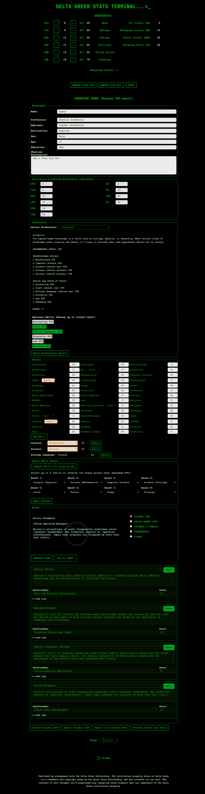
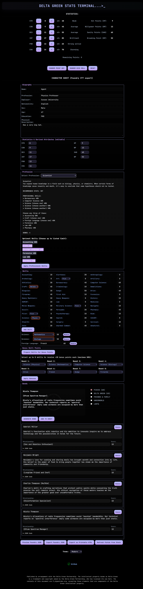

## DELTA-GREEN-STATS

https://pigeon-labs-stack.github.io/DELTA-GREEN-STATS/

## Overview
DELTA-GREEN-STATS is a comprehensive character creation and management tool for the Delta Green Role-Playing System. Built with vanilla HTML/CSS/JavaScript, it provides multiple character creation methods, profession selection, bonus skill points, bond management, and seamless integration with Foundry VTT through JSON export functionality.

#### Theme Options
<div style="display: flex; gap: 20px; justify-content: center; flex-wrap: wrap;">
  <div style="flex: 1; min-width: 300px;">
    <h5>X-Files Theme (Default)</h5>
    
  </div>
  <div style="flex: 1; min-width: 300px;">
    <h5>Modern Theme</h5>
    
  </div>
</div>

### Features

#### Character Creation Methods
- **Point Buy System**: Manually distribute 72 points across six statistics (STR, CON, DEX, INT, POW, CHA)
- **Random Point Buy**: Automatically allocates points randomly for quick character generation
- **Random Dice Roll**: Simulates rolling 4d6 (keeping highest 3) for each stat
- **Real-time Attributes**: Automatic calculation of derived attributes:
  - Hit Points (HP) = ceil((STR + CON) / 2)
  - Willpower Points (WP) = POW
  - Sanity Points (SAN) = POW × 5
  - Breaking Point (BP) = SAN - POW

#### Profession System
- **20 Delta Green Professions**: Choose from official professions like Agent, Academic, Soldier, Hacker, and more
- **Profession Skills**: Each profession provides predefined base skills
- **Optional Skills**: Select from profession-specific optional skills
- **Auto-Apply**: Click to automatically apply profession skills to your sheet

#### Skills & Specialties
- **42+ Delta Green Skills**: Full skill list with realistic default proficiencies
- **Specialty Support**: Select specialties for Art, Craft, Science, Pilot, and Military Science
- **Custom Skills**: Add any additional skills (languages, special abilities, etc.)
- **Bonus Skill Points**: Boost up to 8 skills with +20 points each (max 80%)

#### Bonus Skill Points System
- **Strategic Enhancement**: After building your base skills, use bonus points to fine-tune your character
- **D&D-Style Boost**: Pick any 8 skills and add +20 to each (capped at 80%)
- **Full Support**: Works with base skills, specialties, and custom skills
- **Easy Management**: Hidden until you're ready, triggered with one button click

#### Bond System
- **Bond Generation**: Randomly generate bonds from 5 categories:
  - PISCES (UK)
  - DELTA GREEN (US)
  - FRIENDS & FAMILY
  - UNDERWORLD
  - LGBTQ
- **Bond Management**: Add multiple bonds to your character sheet with editable names and scores
- **Structured Export**: Bonds export as individual items in Foundry VTT format

#### Foundry VTT Integration
- **Complete JSON Export**: Export actor data compatible with Foundry VTT Delta Green system
- **Typed Skills**: Specialty skills available in Foundry's typed skills system
- **Bond Items**: Bonds export as bond-type items with proper structure
- **Token Configuration**: Includes prototype token with proper icon and display settings

#### Theming
- **X-Files Theme**: Classic green-on-black terminal aesthetic (default)
- **Modern Theme**: Catppuccin-inspired color palette with improved readability
- **Theme Persistence**: Selected theme saves automatically

## Quick Start Guide - Complete Walkthrough

### Step 1: Create Your Stats
1. Choose one of three methods:
   - **Point Buy**: Manually drag points to each stat (you have 72 to distribute)
   - **Random Point Buy**: Click "RANDOM POINT BUY" for instant random allocation
   - **Dice Roll**: Click "RANDOM DICE ROLL" to roll 4d6 three times per stat
2. See your derived attributes (HP, WP, SAN, BP) update automatically

### Step 2: Choose a Profession
1. Scroll to the "Profession" section
2. Click the dropdown and select a profession (e.g., "Agent", "Scientist", "Soldier")
3. Read the profession description
4. Select optional skills from the checkboxes (respecting the limit shown)
5. Click "Apply Professional Skills" to add them to your sheet

### Step 3: Build Your Skills
1. Scroll to the "Skills" section
2. You'll see all 42+ Delta Green skills with their base values
3. For skills with specialties (Art, Craft, Science, etc.):
   - Select a specialty type from the dropdown (e.g., "Chemistry" for Science)
   - The skill will be recorded as "Science (Chemistry)"
4. **Add Custom Skills**: Click "Add Skill" to add any custom skill:
   - Enter skill name (e.g., "French", "Piloting (Helicopter)")
   - Enter proficiency (0-80)
   - Click Remove to delete custom skills
5. Don't worry about reaching exactly 80% - that's what bonus points are for!

### Step 4: Apply Bonus Skill Points (NEW!)
1. After setting up your skills, click "Prepare Skills for Bonus Points"
2. The "Bonus Skill Points" section will appear with 8 dropdown menus
3. For each dropdown:
   - Select a skill you want to boost (base skills, specialties, or custom skills)
   - You can select the same skill multiple times to boost it more
   - Maximum boost per skill: +20 per selection, capped at 80%
4. Click "Apply Bonus Skills" to add +20 to each selected skill
5. Your skill values update instantly!
6. **Tip**: Each selection can be any skill - no restriction on duplicates

### Step 5: Fill in Character Details
1. Go to the "Biography" section
2. Enter your character's details:
   - Profession, Employer, Nationality
   - Sex, Age, Education
   - Physical Description (longer text field)

### Step 6: Generate and Add Bonds (Optional)
1. In the "STATISTICS" section, select bond categories you want
2. Click "GENERATE BOND" to create a random bond
3. See the generated bond appear in the text box
4. Click "ADD TO SHEET" to add it to your character
5. Repeat to add multiple bonds

### Step 7: Export Your Character
1. Scroll to the bottom of the Character Sheet
2. Click "Preview Foundry JSON" to see what will be exported
3. Click "Export Foundry JSON" to download a JSON file
4. In Foundry VTT:
   - Open your Delta Green world
   - Click "Import Data"
   - Select the downloaded JSON file
   - Your character will be created!

## Technologies Used
- **HTML5**: Semantic markup with proper metadata
- **CSS3**: Organized styling with CSS variables for easy customization
- **JavaScript (Vanilla)**: No dependencies - uses plain ES6+ JavaScript
- **Foundry VTT Integration**: Compatible with Delta Green system
### Customization

#### Changing Colors
Edit the CSS variables at the top of `styles.css`:
```css
:root {
    --primary-color: #00b521;
    --bg-color: #000000;
    --text-color: #ffffff;
    /* etc... */
}
```

#### Adding Skills
Edit the `skillsList` array in `scripts.js` within `populateCharacterSheetForm()`:
```javascript
const skillsList = [
    ["accounting", "Accounting", 10],
    ["your_skill", "Your Skill", 20, false], // false = no specialty, true = has specialty
    // ...
];
```

#### Modifying Derived Attributes
Update the calculation formulas in `populateCharacterSheetForm()`:
```javascript
const hp = Math.ceil((STRv + CONv) / 2);  // HP formula
const san = POWv * 5;  // SAN formula
// etc...
```

#### Adding Bond Categories
Edit `bonds.js` to add new categories:
```javascript
const bonds = {
    YOUR_CATEGORY: [
        "Bond text here ^ ^ Relationship ^ ^ Description",
        // ...
    ]
};
```

## File Structure
```
DELTA-GREEN-STATS/
├── index.html          # Main HTML structure
├── scripts.js          # Core application logic
├── styles.css          # All styling (organized by section)
├── bonds.js            # Bond data and categories
├── README.md           # This file
└── assets/
    └── art/            # Images and logos
```

## Code Organization

### scripts.js - Key Functions

**Character Creation**
- `randomStats()` - Randomly distribute 72 points
- `randomDiceRoll()` - Roll 4d6 and apply to stats
- `resetStats()` - Clear all and return to start

**Skills & Bonus Points**
- `populateCharacterSheetForm()` - Display all skills
- `addCustomSkill()` - Add custom skill rows
- `getCustomSkills()` - Retrieve all custom skills
- `prepareBonusSkills()` - Show bonus points section
- `populateBonusSkillDropdowns()` - Create 8 bonus selectors
- `applyBonusSkills()` - Apply +20 to selected skills

**Professions**
- `selectProfession()` - Display selected profession info
- `applyProfessionSkills()` - Add profession skills to sheet

**Export & Data**
- `buildFoundryJSON()` - Construct complete JSON export
- `populateCharacterJSON()` - Preview the JSON
- `exportCharacterJSON()` - Download JSON file
- `generateRandomBond()` - Create random bond
- `addBondToSheet()` - Add bond to character

### styles.css - Organization
- **Configuration**: CSS variables for colors and spacing
- **Layout**: Grid and flexbox arrangements
- **Components**: Buttons, inputs, fieldsets, skills grid
- **Theming**: X-Files and Modern theme overrides
- **Bonus Skills**: Styling for bonus skill points section

### bonds.js
- **Bond Categories**: Arrays of bond strings by category
- **Bond Format**: `"Name ^ ^ Relationship ^ ^ Description"` format

## Foundry VTT Export Format

Exported JSON includes:
```json
{
  "name": "Character Name",
  "type": "agent",
  "img": "icons/svg/mystery-man.svg",
  "prototypeToken": { ... },
  "system": {
    "health": { value, min, max },
    "wp": { value, min, max },
    "statistics": { str, con, dex, int, pow, cha },
    "skills": { ... },
    "typedSkills": { ... },
    "sanity": { ... },
    "biography": { ... },
    "physical": { ... },
    "corruption": { ... }
  },
  "items": [ /* bonds and other items */ ]
}
```

## Troubleshooting

**Q: Bonus Skill Points section isn't showing**
- A: First add some skills or select profession skills, then click "Prepare Skills for Bonus Points"

**Q: Skills are showing wrong values after applying bonuses**
- A: Make sure you apply bonus skills, not individual selections. Each "Boost" dropdown adds +20

**Q: JSON export doesn't import to Foundry**
- A: Ensure you have the Delta Green system installed in Foundry. Check the JSON preview for any errors

**Q: Specialty skills aren't appearing in Foundry**
- A: They export to `typedSkills`. Make sure your Foundry Delta Green system supports typed skills

## Development

### Project Goals
- Keep the tool lightweight and dependency-free
- Maintain ease of customization for other users
- Ensure compatibility with Foundry VTT Delta Green system
- Provide clear, well-commented code
- User-friendly walkthrough for character creation

### Contributing
Contributions are welcome! Please:
1. Fork the repository
2. Create a feature branch
3. Submit a pull request with clear descriptions

## Browser Support
- Chrome/Chromium 90+
- Firefox 88+
- Safari 14+
- Edge 90+

## License
This project is open source and available under the MIT License. Feel free to use, modify, and distribute as you see fit, keeping in mind the spirit of role-playing games and community collaboration.

---

<div align="center">
    
</div>

<p align="center">
  Built with ❤️ by <a href="https://github.com/pigeon-labs-stack">Pigeon Labs Stack</a> for Delta Green enthusiasts and role-playing game fans everywhere.
</p>


