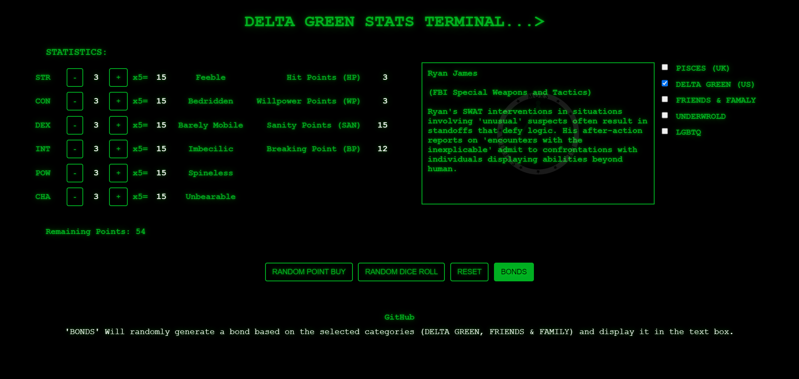

## DELTA-GREEN-STATS

https://pigeonfx.github.io/DELTA-GREEN-STATS/

## Overview
DELTA-GREEN-STATS is a comprehensive character creation and management tool for the Delta Green Role-Playing System. Built with vanilla HTML/CSS/JavaScript, it provides multiple character creation methods, bond management, and seamless integration with Foundry VTT through JSON export functionality.

 

### Features

#### Character Creation
- **Point Buy System**: Manually distribute a fixed number of points (72) across six statistics (STR, CON, DEX, INT, POW, CHA)
- **Random Point Buy**: Automatically allocates points randomly for quick character generation
- **Random Dice Roll**: Simulates rolling 4d6 (keeping highest 3) for each stat
- **Real-time Attributes**: Automatic calculation of derived attributes:
  - Hit Points (HP) = ceil((STR + CON) / 2)
  - Willpower Points (WP) = POW
  - Sanity Points (SAN) = POW × 5
  - Breaking Point (BP) = SAN - POW
- **Reset Functionality**: Clear all values and return to base state

#### Skills & Specialties
- **Full Skill List**: 42+ Delta Green skills with default proficiency values
- **Specialty Support**: Select specialty variants for Art, Craft, Science, Pilot, and Military Science skills
- **Typed Skills Export**: Specialty skills automatically export to Foundry VTT's `typedSkills` system

#### Bond System
- **Bond Generation**: Randomly generate bonds from 5 categories:
  - PISCES (UK)
  - DELTA GREEN (US)
  - FRIENDS & FAMILY
  - UNDERWORLD
  - LGBTQ
- **Bond Management**: Add multiple bonds to your character sheet with editable names, relationships, and scores
- **Structured Export**: Bonds export as individual items in Foundry VTT format

#### Character Sheet
- **Full Form**: Complete character information including biography, physical description, and corruption tracking
- **Field Mapping**: All character data maps directly to Delta Green/Foundry VTT system fields

#### Foundry VTT Integration
- **JSON Export**: Export complete actor data compatible with Foundry VTT Delta Green system
- **Bond Items**: Bonds export as bond-type items with proper structure
- **Typed Skills**: Specialty skills available in Foundry's typed skills system
- **Token Configuration**: Includes prototype token with proper icon and display settings
- **Backup Items**: Can include additional items (weapons, gear, etc.) via JSON editing

#### Theming
- **X-Files Theme**: Classic green-on-black terminal aesthetic (default)
- **Modern Theme**: Catppuccin-inspired color palette with improved readability
- **Theme Persistence**: Selected theme saves to browser localStorage

### UI/UX Features
- **Hover Info**: Context-sensitive help text for all buttons
- **Inline Help**: Shows what each button does on hover
- **Visual Feedback**: Typing effects for bond generation
- **Responsive Design**: Works on desktop and mobile devices
- **Production-Ready**: Clean, maintainable code with clear separation of concerns

## Technologies Used
- **HTML5**: Semantic markup with proper metadata
- **CSS3**: Organized styling with CSS variables for easy customization
- **JavaScript (Vanilla)**: No dependencies - uses plain ES6+ JavaScript
- **Foundry VTT Integration**: Compatible with Delta Green system

## Getting Started

### Usage
1. Open https://pigeonfx.github.io/DELTA-GREEN-STATS/ in any modern browser
2. Create your character using Point Buy, Random Point Buy, or Dice Roll
3. Fill in your character details in the Character Sheet section
4. (Optional) Generate bonds and add them to your sheet
5. Click "Export Foundry JSON" to download your character
6. Import the JSON file into your Foundry VTT Delta Green world

### Customization

#### Changing Colors
Edit the CSS variables at the top of `styles.css`:
```css
:root {
    --primary-color: #00b521;
    --bg-color: #000000;
    --text-color: #ffffff;
    /* etc... */
}
```

#### Adding Skills
Edit the `skillsList` array in `scripts.js` within `populateCharacterSheetForm()`:
```javascript
const skillsList = [
    ["accounting", "Accounting", 10],
    ["your_skill", "Your Skill", 20, false], // false = no specialty, true = has specialty
    // ...
];
```

#### Modifying Derived Attributes
Update the calculation formulas in `populateCharacterSheetForm()`:
```javascript
const hp = Math.ceil((STRv + CONv) / 2);  // HP formula
const san = POWv * 5;  // SAN formula
// etc...
```

#### Adding Bond Categories
Edit `bonds.js` to add new categories:
```javascript
const bonds = {
    YOUR_CATEGORY: [
        "Bond text here ^ ^ Relationship ^ ^ Description",
        // ...
    ]
};
```

## File Structure
```
DELTA-GREEN-STATS/
├── index.html          # Main HTML structure
├── scripts.js          # Core application logic
├── styles.css          # All styling (organized by section)
├── bonds.js            # Bond data and categories
├── README.md           # This file
└── assets/
    └── art/            # Images and logos
```

## Code Organization

### styles.css
- **Configuration Section**: CSS variables for colors and spacing
- **Utility Classes**: Reusable styling patterns
- **Layout**: Grid and flexbox arrangements
- **Components**: Buttons, inputs, fieldsets
- **Theming**: X-Files and Modern theme overrides
- **Responsive**: Media queries for mobile devices

### scripts.js
- **Configuration**: Game mechanics constants (stats, attributes)
- **Utility Functions**: DOM manipulation helpers
- **Character Generation**: Point buy, dice roll, reset logic
- **Character Sheet**: Form population and display
- **Foundry Export**: JSON building for VTT import
- **Bonds**: Bond generation and management
- **Theme Management**: Dark/light theme toggling

### bonds.js
- **Bond Categories**: Arrays of bond strings by category
- **Bond Format**: `"Name ^ ^ Relationship ^ ^ Description"` format

## Foundry VTT Export Format

Exported JSON includes:
```json
{
  "name": "Character Name",
  "type": "agent",
  "img": "icons/svg/mystery-man.svg",
  "prototypeToken": { ... },
  "system": {
    "health": { value, min, max },
    "wp": { value, min, max },
    "statistics": { str, con, dex, int, pow, cha },
    "skills": { ... },
    "typedSkills": { ... },
    "sanity": { ... },
    "biography": { ... },
    "physical": { ... },
    "corruption": { ... }
  },
  "items": [ /* bonds and other items */ ]
}
```

## Development

### Project Goals
- Keep the tool lightweight and dependency-free
- Maintain ease of customization for other users
- Ensure compatibility with Foundry VTT Delta Green system
- Provide clear, well-commented code

### Contributing
Contributions are welcome! Please:
1. Fork the repository
2. Create a feature branch
3. Submit a pull request with clear descriptions

## Browser Support
- Chrome/Chromium 90+
- Firefox 88+
- Safari 14+
- Edge 90+

## License
This project is open source and available under the MIT License. Feel free to use, modify, and distribute as you see fit, keeping in mind the spirit of role-playing games and community collaboration.

---

<div align="center">
    
</div>

<p align="center">
  Built with ❤️ by <a href="https://github.com/PigeonFX">Pigeon</a> for Delta Green enthusiasts and role-playing game fans everywhere.
</p>


